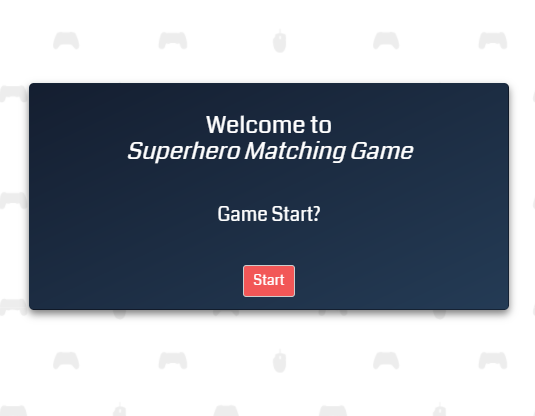
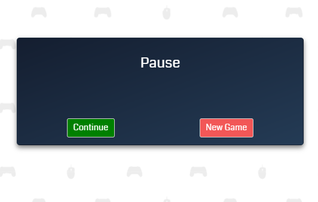

# Superhero-Matching-Game

## Table of Contents
* [Project Background](#project-background)
* [Project Content](#project-content)
* [Load the Game](#load-the-game)
* [How to Play](#how-to-play)
* [Bugs and Feature Requests](#bugs-and-feature-requests)

## Project Background
This game is built as the project for Udacity Intro to Programming Nanodegree Program - Front-End Development. This project demonstrate mastery of HTML, CSS and Javascript. It is a complete browser-based card matching game.
For more detailed description and instruction, please visit [Udacity Classroom] (https://classroom.udacity.com/nanodegrees/nd000/parts/95029f6c-33fb-4dd0-b200-ad40da075a8d/modules/1050afbb-ced4-4919-900f-6b197dc2e9b1/lessons/7781c514-aca1-4d8c-8c1e-721f2e0b3746/concepts/0a38769e-8e23-4e3f-9482-d8d1aa80fbb6).

## Project Content
This project contains following files:
- game.html
- game.css
- game.js
- images file: containing all superhero images for the cards
- screenshot file: containing screenshot of the game
- README.md: explanation of the game

## Load the Game
Download the project zip file to your pc and unzip the file. Or clone the repo to your pc.
Open game.html in browser. Your browser should launch the game.

## How to Play
After loading the game, click on "Start" button when prompted. Timer will start running.

The screen will show a game board consists of sixteen cards arranged in a grid. The deck is made up of eight different pairs of cards, each with different superhero image on one side. The cards are arranged randomly on the grid with the image face down. The star rating on top left reflects the player performance. The more number of moves made by player, the less the stars. The move counter displays the current number of moves made by player. Timer on the top right of the game board display time taken by player while playing. The pause button allows the player to pause the game. The restart button allows player to reset the game board, the timer, and the star rating.

The gameplay rules are very simple: flip over two hidden cards at a time to locate the ones that match. When card is clicked, it will be flipped open. If two opened cards match, the cards will stay flipped over with backgrounds turn to yellow.

If the cards do not match, the background of cards appear red and cards will be flipped face down and remain hidden state.

Once player complete the game, a modal appears to congratulate the player and ask if they want to play again. It also displays the star rating, number of moves and time taken by player to win the game. It also displays the best score made by player in his/her play history.

During the period of playing, player can pause the game. The timer is paused and a modal appears asking if player wants to continue the game or start a new game.

## Bugs and Feature Requests
If there is a bug or feature request, please open an [issue](https://github.com/eileenwong9305/Superhero-Matching-Game/issues/new).

## Resources Used
### Superhero Images:
- <https://www.vecteezy.com/vector-art/153947-super-heroes-vectors>
- <https://www.vecteezy.com/vector-art/153962-super-heroes-vector>
- <https://www.vecteezy.com/vector-art/153966-super-heroes-vector>

### Screen Background Image:
- <https://www.toptal.com/designers/subtlepatterns/>

### Font:
- <https://fonts.googleapis.com/css?family=Coda>

### Pause and Restart Icon:
- <https://maxcdn.bootstrapcdn.com/font-awesome/4.6.1/css/font-awesome.min.css>

### Deck Gradient Background:
- <https://uigradients.com/#Royal>

### Timer:
- <https://www.w3schools.com/howto/howto_js_countdown.asp>

### Modal:
- <https://v4-alpha.getbootstrap.com/components/modal/>

### Shuffle Function:
- <http://stackoverflow.com/a/2450976>

### Grid of Responsive Squares
- <https://stackoverflow.com/questions/20456694/grid-of-responsive-squares>

### Bootstrap
- <https://maxcdn.bootstrapcdn.com/bootstrap/3.3.7/css/bootstrap.min.css>
- <https://maxcdn.bootstrapcdn.com/bootstrap/3.3.7/js/bootstrap.min.js>

### jQuery
- <https://code.jquery.com/jquery-1.12.4.min.js>
- <https://code.jquery.com/ui/1.12.1/jquery-ui.min.js>

### Udacity Starter Code
- <https://github.com/udacity/fend-project-memory-game>
